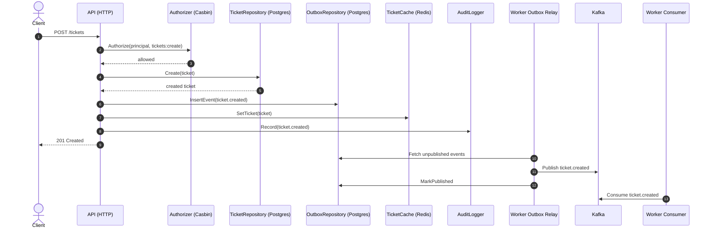
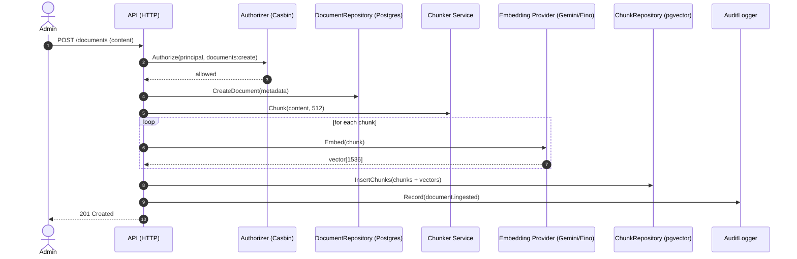

# AI Support Platform

This repository uses Go's tool management together with Task to provide a single entrypoint for development commands.

## Prerequisites

- Go 1.26+
- VS Code with the Go extension, or GoLand

## Install tools

Install the project-managed CLI tools defined in `go.mod`:

```bash
go install tool
```

If your Go version does not support that workflow yet, you can still run commands through Go directly with `go tool ...` after dependencies are downloaded.

This includes Delve for debugging because `github.com/go-delve/delve/cmd/dlv` is tracked in the Go tool block.

## Editor setup

If you use VS Code, install the official Go extension: `golang.go`.

The workspace settings in `.vscode/settings.json` are configured to:

- enable format on save
- use `goimports` as the formatter
- enable in-editor test discovery
- run lint on save with `golangci-lint`
- pass `-race` to test runs in the editor

Debugging is configured in `.vscode/launch.json` for:

- launching the current package
- launching the current file
- attaching to a Delve server on port `2345`

To install Delve locally for the project toolchain:

```bash
go install tool
```

To install only Delve directly:

```bash
go tool dlv version
```

If the binary is not installed yet, run:

```bash
go install github.com/go-delve/delve/cmd/dlv@latest
```

## Task commands

List available tasks:

```bash
go tool task --list
```

Install repo-managed tools and verify key editor tooling:

```bash
go tool task bootstrap
```

Run the development server with hot reload:

```bash
go tool task run
```

Start Delve for the API entrypoint when `cmd/api` exists:

```bash
go tool task debug:api
```

Start Delve for the worker entrypoint when `cmd/worker` exists:

```bash
go tool task debug:worker
```

Format the codebase:

```bash
go tool task fmt
```

Run lint checks:

```bash
go tool task lint
```

Run tests with the race detector:

```bash
go tool task test
```

Run containerized black-box E2E tests:

```bash
go tool task e2e:up
go tool task e2e:test
go tool task e2e:down
```

Run tests with coverage and write a JUnit report to `tmp/unit-tests.xml`:

```bash
go tool task coverage
```

Generate an HTML coverage report at `tmp/coverage.html`:

```bash
go tool task coverage:html
```

Run vulnerability checks:

```bash
go tool task vuln
```

Run code generators:

```bash
go tool task generate
```

Pass goose arguments through Task:

```bash
go tool task migrate -- -dir db/migrations postgres "$DATABASE_URL" status
```

Pass mockery arguments through Task:

```bash
go tool task mocks -- --all --output internal/mocks
```

## Notes

- `test`, `coverage`, and `coverage:html` run with `-race` enabled.
- Coverage artifacts are written under `tmp/`.
- `migrate` and `mocks` are thin wrappers around `go tool goose` and `go tool mockery` so you can keep command usage flexible.
- `debug:api` and `debug:worker` require `cmd/api` and `cmd/worker` directories to exist.
- The E2E stack is defined in `compose.e2e.yaml` and exposes the API at `http://localhost:18080`.
- E2E scenarios are implemented with Ginkgo/Gomega in `test/e2e`.

## Technology stack and libraries

### Core stack

- Language: Go 1.26+
- API: HTTP + OpenAPI + GraphQL
- Datastores: PostgreSQL 17 + pgvector, Redis 8
- Messaging: Apache Kafka (KRaft)
- AI: Google Gemini via Eino provider abstraction
- Runtime: Docker + Docker Compose (`compose.yaml`, `compose.e2e.yaml`)

### Infrastructure services (local development)

- `pgvector/pgvector:pg17` for PostgreSQL + vector similarity search
- `redis:8-alpine` for cache/rate-limit/idempotency
- `bitnamilegacy/kafka:3.9` for event streaming
- `provectuslabs/kafka-ui` for Kafka topic and message inspection

### Application/runtime libraries (direct dependencies)

- `github.com/go-chi/chi/v5`: HTTP router and middleware composition
- `github.com/getkin/kin-openapi`: OpenAPI parsing/validation utilities
- `github.com/oapi-codegen/runtime`, `github.com/oapi-codegen/nethttp-middleware`: OpenAPI runtime/middleware support
- `github.com/99designs/gqlgen`, `github.com/vektah/gqlparser/v2`: GraphQL schema-first API implementation
- `github.com/swaggo/http-swagger/v2`: Swagger UI endpoint
- `github.com/jackc/pgx/v5`: PostgreSQL driver/pool
- `github.com/pgvector/pgvector-go`: pgvector integration for embeddings
- `github.com/redis/go-redis/v9`: Redis client
- `github.com/twmb/franz-go`: Kafka producer/consumer
- `github.com/casbin/casbin/v2`: authorization policy engine
- `github.com/golang-jwt/jwt/v5`: JWT token issuance/verification
- `github.com/go-playground/validator/v10`: request validation
- `github.com/google/uuid`: UUID generation/parsing
- `github.com/kelseyhightower/envconfig`: environment-based config loading
- `github.com/cloudwego/eino`: AI orchestration abstractions
- `github.com/cloudwego/eino-ext/components/model/gemini`: Gemini model integration
- `github.com/cloudwego/eino-ext/components/embedding/gemini`: Gemini embedding integration
- `google.golang.org/genai`: Google GenAI client
- `golang.org/x/crypto`: password hashing/security utilities
- `github.com/stretchr/testify`: unit-test assertions/mocks helpers

### Build, codegen, quality and developer tooling

- `github.com/go-task/task/v3/cmd/task`: task runner (`go tool task`)
- `github.com/air-verse/air`: live reload for API/worker
- `github.com/go-delve/delve/cmd/dlv`: debugger
- `golang.org/x/tools/cmd/goimports`: formatting and import management
- `github.com/golangci/golangci-lint/cmd/golangci-lint`: lint orchestration
- `honnef.co/go/tools/cmd/staticcheck`: static analysis
- `golang.org/x/vuln/cmd/govulncheck`: vulnerability scanning
- `gotest.tools/gotestsum`: test output and JUnit formatting
- `github.com/pressly/goose/v3/cmd/goose`: migrations/seeds
- `github.com/sqlc-dev/sqlc/cmd/sqlc`: SQL-to-Go code generation
- `github.com/oapi-codegen/oapi-codegen/v2/cmd/oapi-codegen`: OpenAPI code generation
- `github.com/99designs/gqlgen`: GraphQL code generation
- `github.com/vektra/mockery/v2`: mocks generation
- `github.com/bufbuild/buf/cmd/buf`: Protobuf/API tooling
- `github.com/evilmartians/lefthook/v2`: Git hooks

## Project structure overview

The codebase follows a layered architecture:

- `cmd/api`, `cmd/worker`: process entrypoints
- `internal/app`: use-cases (commands/queries), executors, runtime wiring
- `internal/domain`: entities, repository interfaces, service contracts
- `internal/infra`: adapters for DB, cache, messaging, auth, AI
- `internal/transport`: HTTP and GraphQL delivery layers
- `migrations`: schema and seed SQL scripts
- `openapi`: OpenAPI source and generation config
- `test/e2e`: black-box end-to-end tests

Request flow (high level):

1. Transport layer receives request and resolves principal/context.
2. Application service executes business use-case with authorization.
3. Domain contracts are fulfilled by infrastructure adapters.
4. Side effects (cache, audit, outbox/kafka) are executed.
5. Response is returned via HTTP or GraphQL.

## Sequence diagrams

### 1) Create Ticket + Outbox + Worker



### 2) Ingest Document + Embedding + Vector Search readiness



## C4 component diagram

The following diagram is a C4-style component view of the main containers and components in this repository.

```mermaid
flowchart LR
	subgraph ClientZone[Clients]
		Client[Support Agent / Admin UI]
	end

	subgraph APIContainer[Container: API Service (cmd/api)]
		HTTP[Transport: HTTP Router]
		GQL[Transport: GraphQL Handler]
		AppSvc[Application Services\nCommands/Queries]
		Auth[Auth Component\nJWT + Casbin]
	end

	subgraph WorkerContainer[Container: Worker Service (cmd/worker)]
		Relay[Outbox Relay]
		Consumers[Kafka Consumers]
		Idem[Idempotency Store]
	end

	subgraph DataInfra[Infrastructure]
		PG[(PostgreSQL + pgvector)]
		Redis[(Redis)]
		Kafka[(Kafka)]
		Gemini[Gemini AI Provider]
	end

	Client --> HTTP
	Client --> GQL
	HTTP --> AppSvc
	GQL --> AppSvc
	AppSvc --> Auth
	AppSvc --> Redis
	AppSvc --> Gemini
	AppSvc --> PG

	AppSvc -->|outbox writes| PG
	Relay -->|read unpublished events| PG
	Relay -->|publish| Kafka
	Consumers -->|consume| Kafka
	Consumers --> Idem
	Idem --> Redis
```
